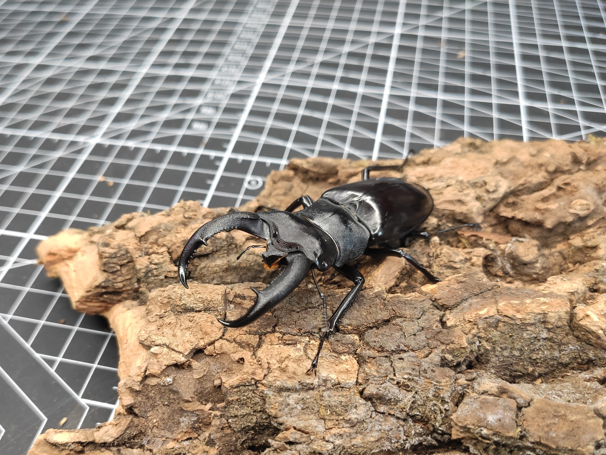

# 犀牛叉角原名亚种（HRR）饲育记录

封面图片

## 繁殖记录

+ 种公母于22年9月29日购于坏笑哥，71×42mm，购时均未出蛰伏
+ 22年12月25日下产，独角仙之家软产木，埋入虫粮1/4，公母同时投入产房
+ 23年1月31日开产房，开得L1幼虫8只，母虫死亡，头胸腹分离，判断被公虫分尸，后切记勿将锹甲公母同时投产，后于产房土中发现1幼，共计9只
+ 2月23日，更换4只幼虫，入800ml虫粮
