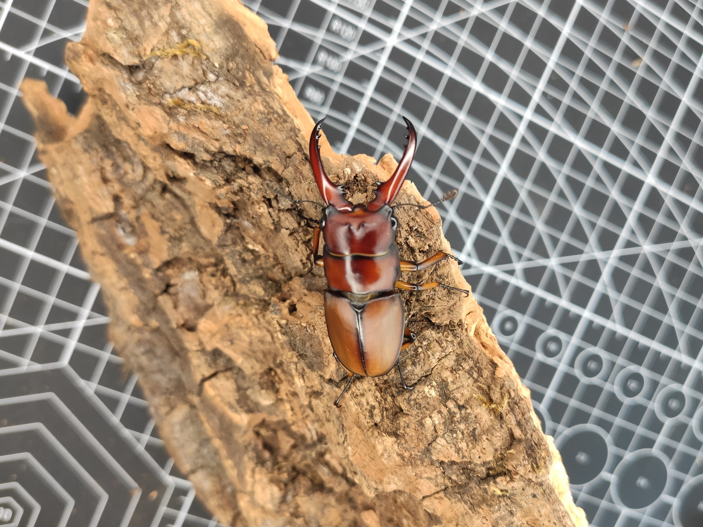

# 大象两点赤饲育小记

封面照片

## 幼虫饲养

2022年4月23日收到一组象两点幼虫，种公68mm。收到时大部分已L2。转入500mL打包盒虫粮饲养。温度为23~26℃不稳定温控。

2022年7月2日第一次换土，母虫继续用500mL打包盒，公虫转入800mL打包盒/1.4L瓶。

2022年7月2日第一次换土

2022年7月23日发现第一只母虫前蛹，8月12日羽化。

Pam No.5 ♀

2022年9月3日挖开第一只公虫蛹，9月14日羽化，仅44mm。

Pam No.2 ♂ 蛹照

Pam No.2 ♂ 羽化44mm

## 数据

+ Pam No.2 ♂ 44mm
    + 2022.3初 已孵化
    + 2022.4.23 500mL打包盒虫粮
    + 2022.7.2 800mL打包盒虫粮，L3 4.3g
    + 2022.7.23 发现前蛹
    + 2022.8.12 羽化

+ Pam No.3 ♂ 未测量，45mm+
    + 2022.3初 已孵化
    + 2022.4.23 500mL打包盒虫粮
    + 2022.7.2 1.4L瓶虫粮，L3 7.5g
    + 2022.9.27 羽化

+ Pam No.1 ♂ 短牙未测量
    + 2022.3初 已孵化
    + 2022.4.23 500mL打包盒虫粮
    + 2022.7.2 1.4L瓶虫粮，L3 6.2g
    + 2022.9.26 羽化

## 小结

本轮饲养成绩远不及种亲，推测原因有：
1. 三月快递被退回，拖到4月底才发，低龄时管理不周；
2. 换土时机不好，L2时换1.4L瓶做好防虫应该可以一罐到底；
3. L3时刚好为夏天，泡沫箱更换冰袋不及时导致温控条件不稳定（种亲为18℃低温饲养个体）。