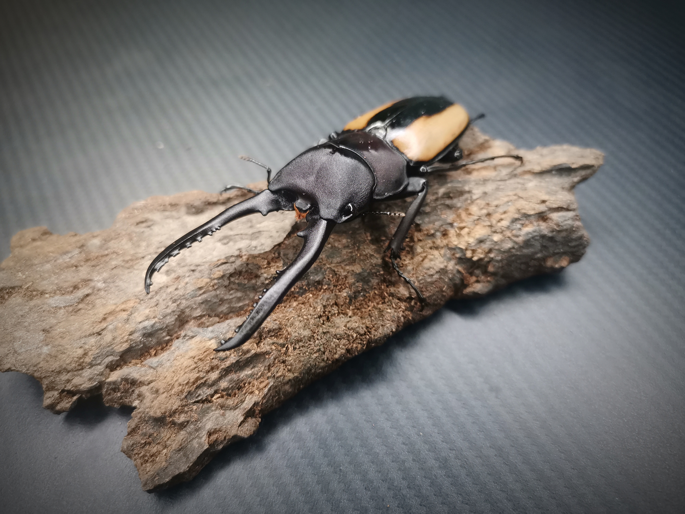
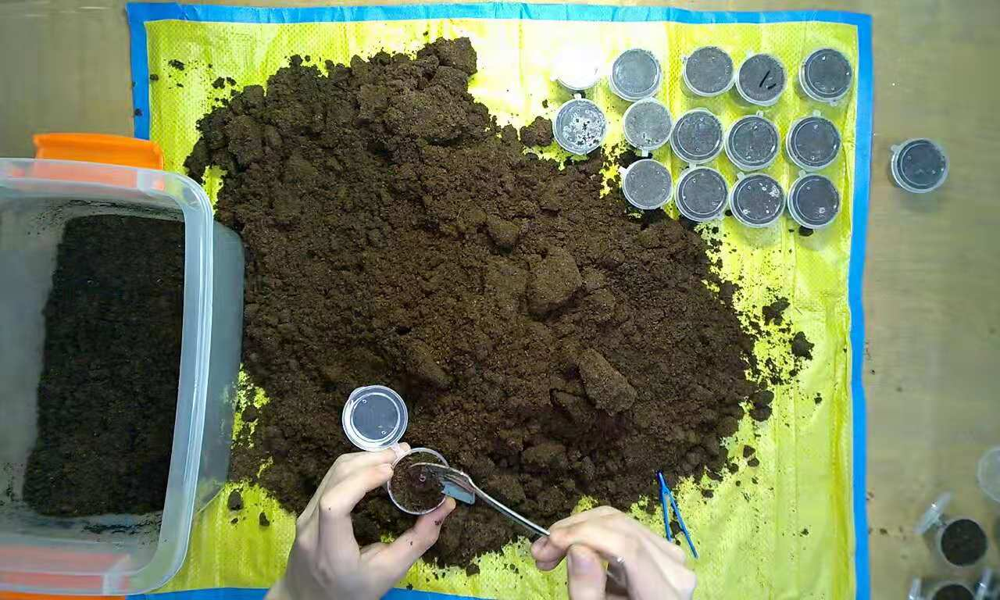
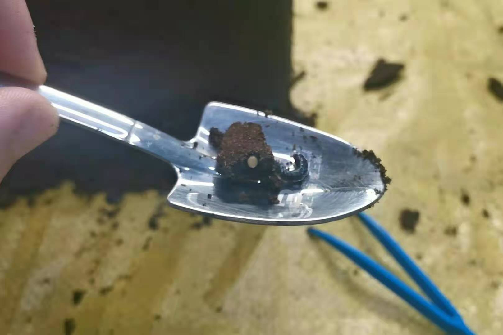
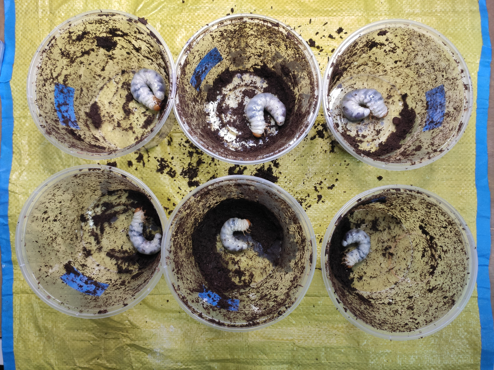
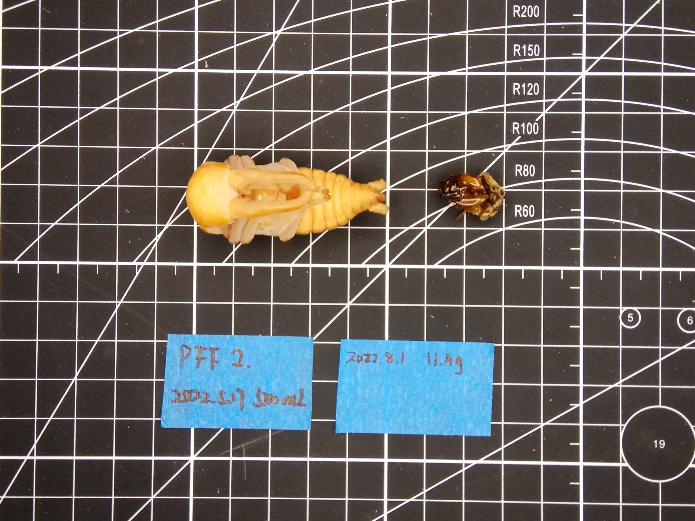
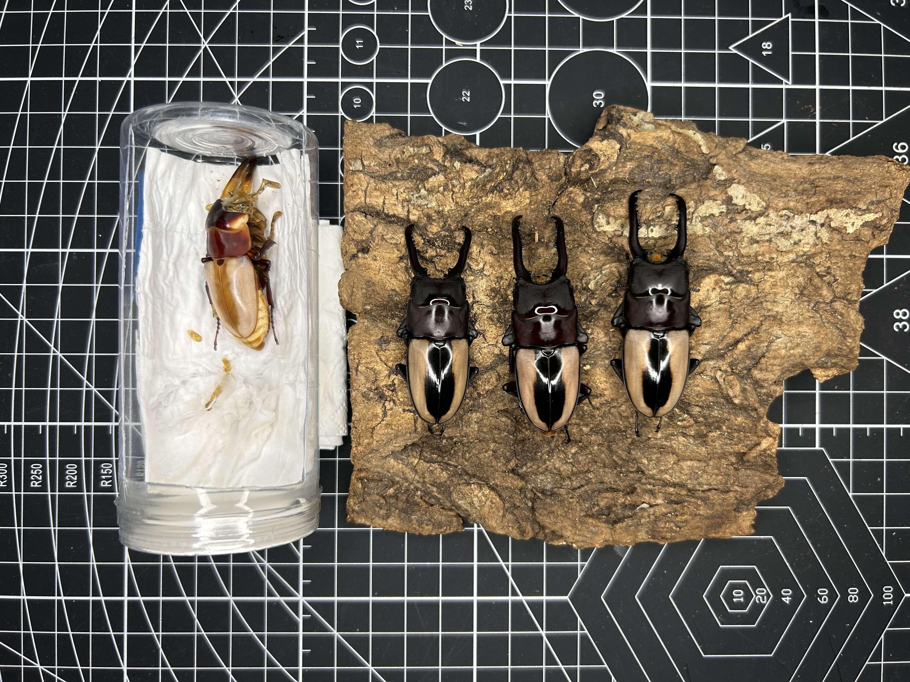

# 直颚侧纹锯锹f亚种饲育小记

封面图片

## 繁殖

2021年10月底购入pff成虫一对，♂ 65mm为蛰伏虫，♀ all size已出蛰。

公母合照

由于北方冬季气温低，蛰伏的公虫直到2022年初春才彻底出蛰伏，出蛰后将公母混养一个月。

2022年3月6日将母虫下产，介质为阿银产房土，5L塑料箱。3月12日开产房得22卵。本轮产卵仅孵化10只幼虫。

2022年3月13日第二轮下产，4月30日开出15幼虫+1卵。

第二轮开产房

卵与L1幼虫

## 幼虫饲育

自留了约3组幼虫。前6只为第一轮所产，使用虫粮木屑；其余为第二轮所产，使用牧野浅度木屑。容器为500mL打包盒+500mL打包盒(♀)/800mL打包盒(♂)。

使用自制泡沫箱温控箱，温度在23-26℃，温控不稳定。

饲养期间折损2~3只幼虫，均为刚孵化或低龄幼虫下土牧野浅度，在第一次换土时消失了。

Pff1~6，L3虫粮饲养

TODO:???第一批母虫化蛹/羽化。

第二批羽化的母虫，2022.10.15

2022年10月初公虫化蛹。

Pff3蛹照，虫粮饲养，2022.10.09

Pff2蛹照，虫粮饲养，2022.10.15

右一为亲代，其余为子代，2022.11.21

## 数据

+ Pff No.2 ♂
    + 2022.3.12 卵
    + 2022.5.17 500mL虫粮
    + 2022.8.1 800mL虫粮，L3 11.4g
    + 2022.10.15 蛹重 7.2g
    + 2022.11.7 羽化 61.7mm

+ Pff No.3 ♂
    + 2022.3.12 卵
    + 2022.5.17 500mL虫粮
    + 2022.8.1 800mL虫粮，L3 12.1g
    + 2022.10.15 蛹重 6.6g
    + 2022.11.3 羽化 57mm

+ Pff No.5 ♂
    + 2022.3.12 卵
    + 2022.5.17 500mL虫粮
    + 2022.8.1 800mL虫粮，L3 11.5g
    + 2022.10.17 蛹重 7.2g
    + 2022.11.15 羽化 61.1mm

+ Pff No.5 ♂
    + 2022.3.12 卵
    + 2022.5.17 500mL虫粮
    + 2022.8.1 800mL虫粮，L3 11.5g
    + 2022.10.17 蛹重 7.2g
    + 2022.11.15 羽化 61.1mm

+ Pff No.8 ♂
    + 2022.4.30 l1
    + 2022.6.5 500mL牧浅
    + 2022.8.12 10.2g
    + 2022.10.22 蛹
    + 羽化 56mm，牙畸形

牧浅、虫粮所饲养母虫均在30mm左右。

