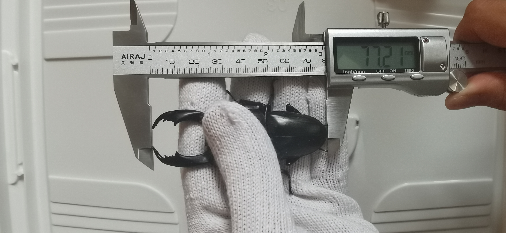

# 帝王巨扁繁殖饲育记录-1

封面照片

## 繁殖记录

种公来自淡淡的反弹，77mm；种母41mm。

+ 2022/??/?? 第一轮下产，（产房布置、产木大小硬度）
+ 2022/??/?? 第一轮开产房，?幼?卵
+ 2022/??/?? 第二轮下产，（产房布置、产木大小硬度）
+ 2022/??/?? 第二轮开产房，?幼?卵
+ ……

## 幼虫饲育记录

Sti头苗：绿霉仔
+ 2022/09/?? L1，入半瓶绿霉感染的FF云芝
+ 2022/10/?? L2，入FF云芝-1.4L（老菌）
+ 2023/01/05 L3，38g，入FF云芝-2.2L
+ 立即开始暴走
