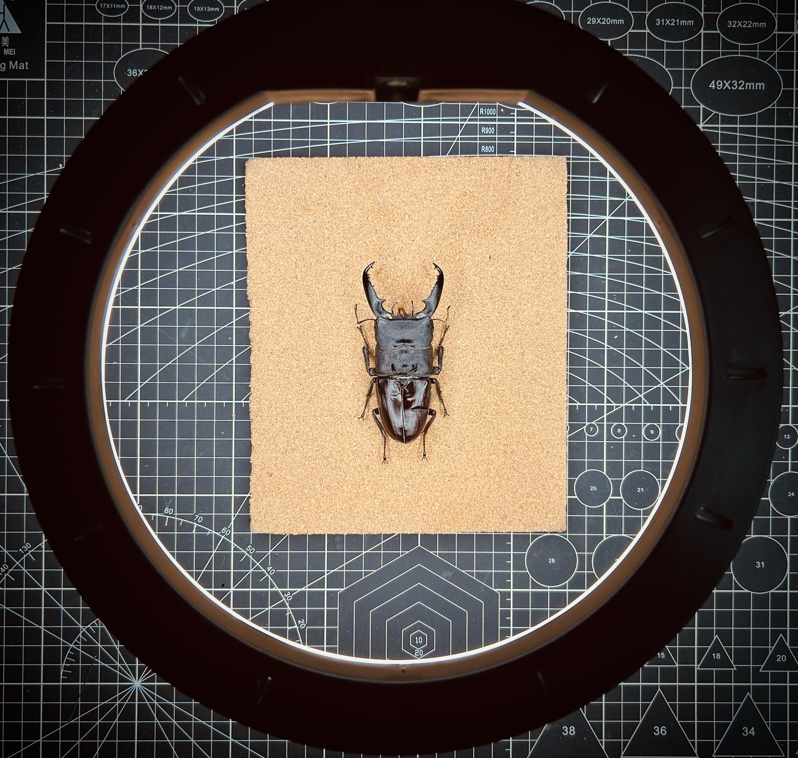

# 巴拉望巨扁饲育记录

封面照片

## 幼虫饲育记录

2021年9月从南京老哥从虫中作梗处入手一组巴拉望巨扁L1幼虫，1公4母。

Stp ♂：
+ 2021/10/21 L1 
+ 2021/11/22 下飞帆雨林1.4云芝菌瓶
+ 2022/02/13 L3 45.7g 下第二瓶雨林1.4云芝
+ 2022/03/20 L3 60.9g 疫情原因云芝短缺，下虫粮，2周左右转飞帆1.4 
+ 2022/05/03 一直暴走 52.2g 转飞帆雨林1.4
+ 2022/09/13 化蛹 蛹重30.8g
+ 2022/10/19 羽化 鞘翅折损，内翅无法收回，渗黑色组织液
+ 2022/10/27 死亡 体长约 91mm

Stp ♀：
+ 2021/10/21 L1 选择一只下雨林1.4云芝
+ 2022/4/12前后 化蛹 蛹重分别为11.3g（云芝） 8.8g  ??g  ??g
+ 2022/05/08 11.3g母死蛹
+ 2022/05/19前后 羽化 剩余个体体长为 48mm 46mm 42mm
